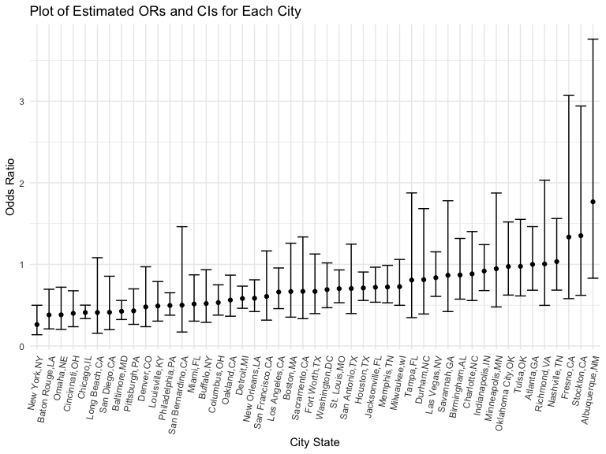
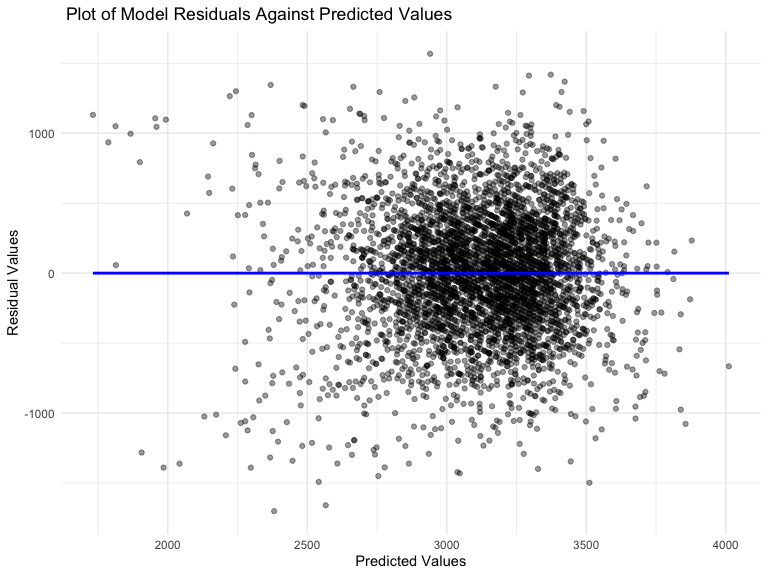
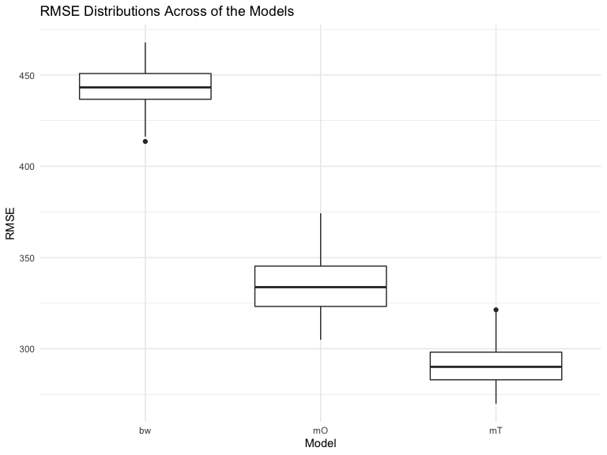
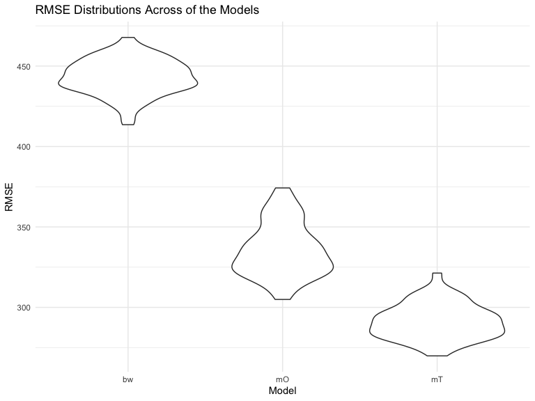

p8105_hw6_ver2117_A
================
Varvy Rousseau
2022-12-03

Loading relevant packages & settings

``` r
library(tidyverse)
```

    ## ── Attaching packages ─────────────────────────────────────── tidyverse 1.3.2 ──
    ## ✔ ggplot2 3.3.6      ✔ purrr   0.3.4 
    ## ✔ tibble  3.1.8      ✔ dplyr   1.0.10
    ## ✔ tidyr   1.2.0      ✔ stringr 1.4.1 
    ## ✔ readr   2.1.2      ✔ forcats 0.5.2 
    ## ── Conflicts ────────────────────────────────────────── tidyverse_conflicts() ──
    ## ✖ dplyr::filter() masks stats::filter()
    ## ✖ dplyr::lag()    masks stats::lag()

``` r
library(modelr)
library(tidyr)
library(p8105.datasets)
library(dplyr)
knitr::opts_chunk$set(
      echo = TRUE,
      warning = FALSE,
      fig.width = 8, 
  fig.height = 6,
  out.width = "90%"
  )
  
theme_set(theme_minimal() + theme(legend.position = "bottom"))
options(
  ggplot2.continuous.colour = "viridis",
  ggplot2.continuous.fill = "viridis")
scale_colour_discrete = scale_colour_viridis_d
scale_fill_discrete = scale_fill_viridis_d
```

\#Problem 2 \#Loading in Homicide Dataset

``` r
homi_df = read.csv("data/homicide-data1.csv", na = c("", "NA", "Unknown")) 
```

\#Create a city_state variable (e.g. “Baltimore, MD”), and a binary
variable indicating whether the homicide is solved. Omit cities Dallas,
TX; Phoenix, AZ; and Kansas City, MO – these don’t report victim race.
Also omit Tulsa, AL – this is a data entry mistake. For this problem,
limit your analysis those for whom victim_race is white or black. Be
sure that victim_age is numeric.

``` r
homi_df = homi_df %>%
  mutate(
    city_state = paste(city, state, sep = ",")) %>%
    select(-city, -state) %>%
  mutate(
    victim_age = as.numeric(victim_age),
    disposition = sapply(disposition, switch,
                       "Closed without arrest" = 0,
                       "Open/No arrest" = 0,
                       "Closed by arrest" = 1)) %>%
  relocate(city_state, .after = victim_sex) %>%
  filter(city_state != "Tulsa,AL") %>%
  filter(victim_race %in% c("Black", "White")) %>%
  select(city_state, disposition, victim_race, victim_age, victim_sex)
```

\#For the city of Baltimore, MD, use the glm function to fit a logistic
regression with resolved vs unresolved as the outcome and victim age,
sex and race as predictors. Save the output of glm as an R object; apply
the broom::tidy to this object; and obtain the estimate and confidence
interval of the adjusted odds ratio for solving homicides comparing male
victims to female victims keeping all other variables fixed.

``` r
Bmore = homi_df %>%
  filter(city_state == "Baltimore,MD")

Bmo_log = glm(disposition ~ victim_age + victim_race + victim_sex,
      data = Bmore, family = binomial())%>%
  broom::tidy() %>% 
  mutate(OR = exp(estimate), 
         CI_higher = exp(estimate +1.96 * std.error),
         CI_lower = exp(estimate -1.96 * std.error)) %>%
  select(term, log_OR = estimate, OR, p.value, starts_with("CI")) %>% 
  knitr::kable(digits = 3)

Bmo_log
```

| term             | log_OR |    OR | p.value | CI_higher | CI_lower |
|:-----------------|-------:|------:|--------:|----------:|---------:|
| (Intercept)      |  0.310 | 1.363 |   0.070 |     1.907 |    0.975 |
| victim_age       | -0.007 | 0.993 |   0.043 |     1.000 |    0.987 |
| victim_raceWhite |  0.842 | 2.320 |   0.000 |     3.268 |    1.648 |
| victim_sexMale   | -0.854 | 0.426 |   0.000 |     0.558 |    0.325 |

\#Now run glm for each of the cities in your dataset, and extract the
adjusted odds ratio (and CI) for solving homicides comparing male
victims to female victims. Do this within a “tidy” pipeline, making use
of purrr::map, list columns, and unnest as necessary to create a
dataframe with estimated ORs and CIs for each city.

``` r
city_log = 
  homi_df %>%
  nest(data = -city_state) %>%
  mutate(
    models = map(.x = data, ~ glm(disposition ~ victim_age + victim_sex + victim_race, data = .x, family = binomial())), results = map(models, broom::tidy)) %>%
  select(results, city_state) %>%
  unnest(results) %>%
  mutate(OR = exp(estimate), 
         CI_higher = exp(estimate +1.96 * std.error),
         CI_lower = exp(estimate -1.96 * std.error)) %>%
  select(term, log_OR = estimate, OR, p.value, starts_with("CI"))
```

\#Create a plot that shows the estimated ORs and CIs for each city.
Organize cities according to estimated OR, and comment on the plot.

``` r
city_log %>%
  filter(term == "victim_sexMale") %>%
  mutate(
    city_state = fct_reorder(city_state, OR)) %>%
  ggplot(aes(x = city_state, y = OR)) + geom_point() +geom_errorbar(aes(ymin = CI_lower, ymax = CI_higher)) + theme(axis.text.x = element_text(angle = 80, hjust = 1)) + labs(title = "Plot of Estimated ORs and CIs for Each City", x = "City State", y = "Odds Ratio")
```


Looking at this plot is appears that, Albuquerque,NM has the highest
upper whisker and upper quartile of odds ratio while Chicago, IL has the
lowest. It is also interesting how the medians of ORs have been
relatively consistent throughout each citystate.

\##Problem 3 \#Loading the Birthweight Dataset

``` r
birth_df = read_csv("data/birthweight.csv")
```

    ## Rows: 4342 Columns: 20
    ## ── Column specification ────────────────────────────────────────────────────────
    ## Delimiter: ","
    ## dbl (20): babysex, bhead, blength, bwt, delwt, fincome, frace, gaweeks, malf...
    ## 
    ## ℹ Use `spec()` to retrieve the full column specification for this data.
    ## ℹ Specify the column types or set `show_col_types = FALSE` to quiet this message.

``` r
birth_df
```

    ## # A tibble: 4,342 × 20
    ##    babysex bhead blength   bwt delwt fincome frace gaweeks malform menarche
    ##      <dbl> <dbl>   <dbl> <dbl> <dbl>   <dbl> <dbl>   <dbl>   <dbl>    <dbl>
    ##  1       2    34      51  3629   177      35     1    39.9       0       13
    ##  2       1    34      48  3062   156      65     2    25.9       0       14
    ##  3       2    36      50  3345   148      85     1    39.9       0       12
    ##  4       1    34      52  3062   157      55     1    40         0       14
    ##  5       2    34      52  3374   156       5     1    41.6       0       13
    ##  6       1    33      52  3374   129      55     1    40.7       0       12
    ##  7       2    33      46  2523   126      96     2    40.3       0       14
    ##  8       2    33      49  2778   140       5     1    37.4       0       12
    ##  9       1    36      52  3515   146      85     1    40.3       0       11
    ## 10       1    33      50  3459   169      75     2    40.7       0       12
    ## # … with 4,332 more rows, and 10 more variables: mheight <dbl>, momage <dbl>,
    ## #   mrace <dbl>, parity <dbl>, pnumlbw <dbl>, pnumsga <dbl>, ppbmi <dbl>,
    ## #   ppwt <dbl>, smoken <dbl>, wtgain <dbl>

## Cleaning the birthweight dataset

``` r
birth_w = 
  birth_df %>%
  janitor::clean_names() %>%
  mutate(
    frace = as.factor(frace),
    mrace = as.factor(mrace),
    babysex = as.factor(babysex),
    malform = as.factor(malform)) 

sapply(birth_w, function(x) sum(is.na(x)))
```

    ##  babysex    bhead  blength      bwt    delwt  fincome    frace  gaweeks 
    ##        0        0        0        0        0        0        0        0 
    ##  malform menarche  mheight   momage    mrace   parity  pnumlbw  pnumsga 
    ##        0        0        0        0        0        0        0        0 
    ##    ppbmi     ppwt   smoken   wtgain 
    ##        0        0        0        0

After loading and tidying the total number of observations is 4342.
There are 4342 rows and 20 columns. Important variables include:
babysex, bhead, blength, bwt, delwt, fincome,frace, gaweeks, malform,
menarche, mheigth, momage, mrace, parity, pnumlbw, pnumgsa, ppbmi, ppwt,
smoken, wtgain.

### My regression model

For my regression model I selected these variables as well as the others
ones listed have a higher effect on a child’s birthweight. The variables
that I have chosen are: - mrace: Mother’s race - fincome: Family monthly
income - gaweeks: Gestational age in weeks - parity:Number of live
births prior to this pregnancy - wtgain: Mother’s weight gain during
pregnancy - bwt: Baby’s birth weight

According to Kelli Komro and her colleagues in the article:“Effects of
State-Level Earned Income Tax Credit Laws on Birth Outcomes by Race and
Ethnicity,” there has been a difference in factors that effect birth
weight. Factors that had a difference among races were the gestational
weeks, the family’s income, and the mother’s race which led me to
include those variables in my model. I also wanted to include the
variable parity and the mother’s weight gain during pregnancy to see if
those variables also made an impact on birth weight. The link to the
article is:
<https://www.ncbi.nlm.nih.gov/pmc/articles/PMC6419088/#>:\~:text=Birth%20weight%20gains%20are%20higher,with%20white%20mothers%2C%20except%20among

``` r
fit_1 = lm(bwt ~ mrace + fincome + gaweeks + parity + wtgain, data = birth_w)
fit_1
```

    ## 
    ## Call:
    ## lm(formula = bwt ~ mrace + fincome + gaweeks + parity + wtgain, 
    ##     data = birth_w)
    ## 
    ## Coefficients:
    ## (Intercept)       mrace2       mrace3       mrace4      fincome      gaweeks  
    ##    814.2390    -232.7574    -105.1164    -134.3426       0.6931      55.2906  
    ##      parity       wtgain  
    ##     98.4928       9.0737

``` r
fit_1 %>%
  broom::glance()
```

    ## # A tibble: 1 × 12
    ##   r.squared adj.r.…¹ sigma stati…²   p.value    df  logLik    AIC    BIC devia…³
    ##       <dbl>    <dbl> <dbl>   <dbl>     <dbl> <dbl>   <dbl>  <dbl>  <dbl>   <dbl>
    ## 1     0.259    0.258  441.    217. 7.66e-277     7 -32597. 65212. 65269.  8.43e8
    ## # … with 2 more variables: df.residual <int>, nobs <int>, and abbreviated
    ## #   variable names ¹​adj.r.squared, ²​statistic, ³​deviance

``` r
fit_1 %>%
  broom::tidy()
```

    ## # A tibble: 8 × 5
    ##   term        estimate std.error statistic   p.value
    ##   <chr>          <dbl>     <dbl>     <dbl>     <dbl>
    ## 1 (Intercept)  814.       88.1        9.24 3.75e- 20
    ## 2 mrace2      -233.       15.3      -15.2  4.36e- 51
    ## 3 mrace3      -105.       68.0       -1.55 1.22e-  1
    ## 4 mrace4      -134.       30.4       -4.42 1.00e-  5
    ## 5 fincome        0.693     0.282      2.46 1.38e-  2
    ## 6 gaweeks       55.3       2.19      25.2  5.91e-131
    ## 7 parity        98.5      65.3        1.51 1.32e-  1
    ## 8 wtgain         9.07      0.619     14.7  1.80e- 47

``` r
fit_1 %>% 
  broom::tidy() %>% 
  select(term, estimate, p.value) %>% 
  knitr::kable(digits = 3)
```

| term        | estimate | p.value |
|:------------|---------:|--------:|
| (Intercept) |  814.239 |   0.000 |
| mrace2      | -232.757 |   0.000 |
| mrace3      | -105.116 |   0.122 |
| mrace4      | -134.343 |   0.000 |
| fincome     |    0.693 |   0.014 |
| gaweeks     |   55.291 |   0.000 |
| parity      |   98.493 |   0.132 |
| wtgain      |    9.074 |   0.000 |

\#Plot of Modoel Residuals Against Fitted Values

``` r
birth_w %>%
  modelr::add_predictions(fit_1) %>%
  modelr::add_residuals(fit_1) %>%
  ggplot(aes(x = pred, y = resid)) + geom_point(alpha = 0.4) + geom_smooth(color = "blue", method = "lm", se = FALSE) + labs(
    title = " Plot of Model Residuals Against Predicted Values",
    x = "Predicted Values",
    y = "Residual Values") 
```

    ## `geom_smooth()` using formula 'y ~ x'



# Compare your model to two others: (1)One using length at birth and gestational age as predictors (main effects only);(2)One using head circumference, length, sex, and all interactions (including the three-way interaction) between these. We are comparing these models using use crossv_mc and functions in purrr as appropriate.

``` r
mod_1 = lm(bwt ~ blength + gaweeks, data = birth_w)
mod_2 = lm(bwt ~ bhead + babysex + blength + bhead*blength + bhead*babysex + blength*babysex + bhead*babysex*blength, data = birth_w)

cv_df = crossv_mc(birth_w, 100) %>%
  mutate(
    train = map(train, as_tibble),
    test = map(test, as_tibble))
  

cv_df = 
  cv_df %>%
  mutate(
   BW_model = map(train, ~lm(bwt ~ mrace + fincome + gaweeks + parity + wtgain, data = .x)),
   Model_O = map(train, ~lm(bwt ~ blength + gaweeks, data = .x)),
   Model_T = map(train, ~lm(bwt ~ bhead + babysex + blength + bhead*blength + bhead*babysex + blength*babysex + bhead*babysex*blength, data = .x))) %>%
   mutate(
    rmse_bw = map2_dbl(BW_model, test, ~rmse(model = .x, data = .y)),
    rmse_mO = map2_dbl(Model_O, test, ~rmse(model = .x, data = .y)),
    rmse_mT = map2_dbl(Model_T, test, ~rmse(model = .x, data = .y)))
```

Here is both a Boxplot and a Violin plots of the prediction error
distribution:

\#Boxplot

``` r
cv_df %>% 
  select(starts_with("rmse")) %>% 
  pivot_longer(
    everything(),
    names_to = "model", 
    values_to = "rmse",
    names_prefix = "rmse_") %>% 
  mutate(model = fct_inorder(model)) %>% 
  ggplot(aes(x = model, y = rmse)) + geom_boxplot() + labs(title = "RMSE Distributions Across of the Models", x = "Model", y = "RMSE")
```



\#Violin plot

``` r
cv_df %>% 
  select(starts_with("rmse")) %>% 
  pivot_longer(
    everything(),
    names_to = "model", 
    values_to = "rmse",
    names_prefix = "rmse_") %>% 
  mutate(model = fct_inorder(model)) %>% 
  ggplot(aes(x = model, y = rmse)) + geom_violin() + labs(title = "RMSE Distributions Across of the Models", x = "Model", y = "RMSE")
```


The plots that I made composing of all three models have shown that
Model Two is the best fit because it has the lowest RMSE compared to the
other two models. Model Two is composed of the head circumference,
length, sex, and all interactions. It seems as if my Model that I made
was not the best as it had the highest RMSE out of all three. :(
